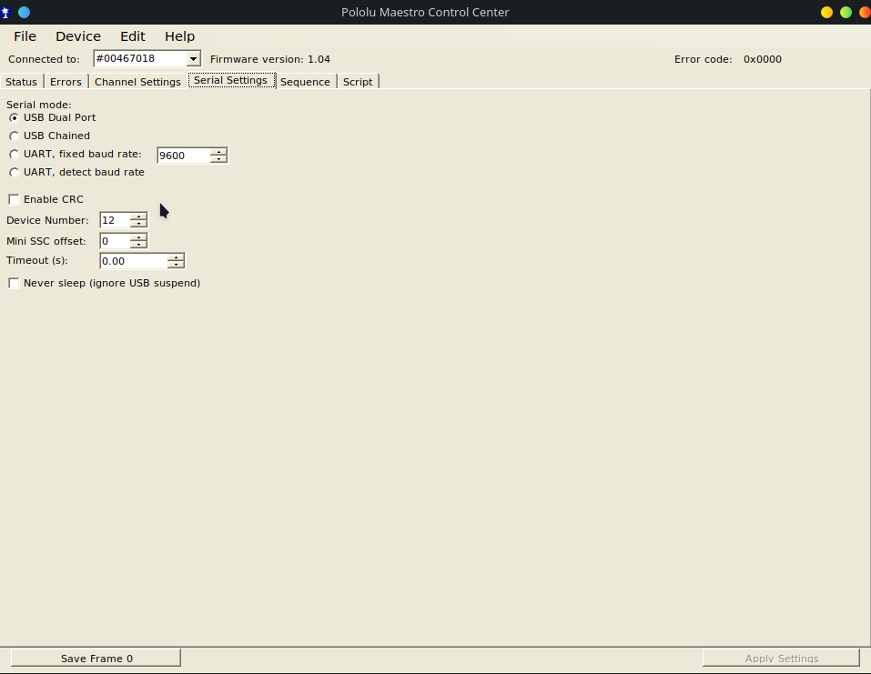

# Jetson Car

This project uses ROS2 to create an autonomous car for Cyber City, running on a Jetson Orin Nano.

## Requirements

- Jetson Jetpack 6.2 install on the Jetson Orin Nano
  
- ROS2 Humble ([installation instructions](https://docs.ros.org/en/humble/Installation/Ubuntu-Install-Debs.html)). Make sure you install `ros-humble-desktop` and `ros-dev-tools` package groups.
  

## Getting Started

**1. Clone repo and Install ROS dependencies**

```bash
git clone https://vaughantd@bitbucket.org/vcuscm/jetson_car.git
cd jetson_car

# Install dependencies
sudo rosdep init
rosdep update
rosdep install --from-paths src --ignore-src -r -y
```

**2. Compile ROS2 Humble cv_bridge package from source**

The default cv_bridge uses a different opencv version than what comes with Jetson linux 6.2. The simple fix is to compile the humble cv_bridge from source on the jetson.


```bash
#start from the home directory
cd ~/
git clone https://github.com/ros-perception/vision_opencv.git
cd vision_opencv/

#switch to the humble branch
git switch humble

#Compile from source
colcon build
source ~/vision_opencv/install/setup.bash
```

**3. Install need packages**

``` bash
sudo apt update
sudo apt install ros-${ROS_DISTRO}-web-video-server

# Install NVIDIA GStreamer plugins
sudo apt install nvidia-l4t-gstreamer

# Install additional GStreamer packages if needed
sudo apt install \
    gstreamer1.0-tools \
    gstreamer1.0-plugins-base \
    gstreamer1.0-plugins-good \
    gstreamer1.0-plugins-bad \
    gstreamer1.0-plugins-ugly \
    gstreamer1.0-libav \
    libgstreamer1.0-dev \
    libgstreamer-plugins-base1.0-dev
```
**4. Install Jetson GPIO Lib**

Install Jetson lib from source:
``` bash
cd ~/Downloads
git clone https://github.com/NVIDIA/jetson-gpio.git
cd jetson-gpio
sudo python3 setup.py install
```

Now setup the PWM pins, run this command:
```
sudo python /opt/nvidia/jetson-io/jetson-io.py 
```

1. Select `Configure Jetson 40pin Header`, then select `Configure header pins manually` 
2. Toggle `pwm1 (15)` and `pwm7 (32)`
3. Select in this order `back`, `Save pin changes`, then `Save and reboot to reconfigure pins`

After the board reboots, the PWM pins will be ready to use. 

**5. Setup the Micro Maestro Servo Pinout**

To access the servo USB control, the user who is running the ros nodes must be part of the dialout group.

```bash
sudo usermod -a -G dialout $USER

#verify you are have been added to the dialout group
groups $USER
```

you should get some output like:

```bash
$ sudo gpasswd -a $USER dialout
[sudo] password for jetson-car:
Adding user jetson-car to group dialout

$ groups $USER
jetson-car : jetson-car adm dialout cdrom sudo audio dip video plugdev render i2c lpadmin gdm gpio weston-launch sambashare
```

The servo controller needs to configured to be in *USB Dual Port* mode, if this is the first time ever using servo controller.

Take the servo control and plug in you laptop or desktop (this step requires a linux machine with desktop environment like ubuntu or fedora).

Download [Maestro Servo Controller Software](https://www.pololu.com/docs/0J40/3.b), this allows you to configure servo controller.

unzip the file and set up environment

```bash
tar -xzvf maestro-linux-241004.tar.gz
cd maestro-linux

#from the README.txt file
sudo apt-get install libusb-1.0-0-dev mono-runtime libmono-system-windows-forms4.0-cil

sudo cp 99-pololu.rules /etc/udev/rules.d/
sudo udevadm control --reload-rules

# now run the gui
./MaestroControlCenter
```

Now that the GUI is open click on ***serial settings*** and select ***USB Dual Port***, then click ***apply setting*** 


**6. Add Environment to your `~/bashrc`**

Add this to the end of you `~/.bashrc` file in your use home directory.

This will source the ROS2 humble packages, the cv_bridge we compile from source, and the Jetson Car project. Then set the ROS Domain that our Cyber City use for wifi communication for vehicles.

```
source /opt/ros/humble/setup.bash
source ~/vision_opencv/install/setup.bash
source ~/jetson_car/install/setup.bash
export ROS_DOMAIN_ID=25
```

***Congrats! your ready run the Self-Driving Car***

## Usage

Make you have compiled the nodes
```
colcon build
```

Then run our launch file that will run all of our nodes need for navigating the ***Cyber City***.
```bash
ros2 launch vehicle_controller launch_nodes.py
```
### Manual Teleoperation
If you want to control the car manually, you can run the teleop node acceptor.
```bash
ros2 launch vehicle_controller teleop.launch.py
```
This will launch the teleop node and wait for input from your keyboard.

In a second terminal, run the teleop node that will listen to your keyboard input and publish the corresponding velocity commands to the car.
```bash
ros2 run twist_teleop_keyboard twist_teleop_keyboard
```

The teleop node will only work if you have the `twist_teleop_keyboard` package installed. You can install it using the following command:
```bash
sudo apt install ros-humble-twist-teleop-keyboard
```
Note: In order to listen to your keyboard inputs, the terminal with `twist_teleop_keyboard` node must be in focus. 
## Packages

Each package in `src/` has its own README that explains the usage, what each node does, how to run it, and its parameters.

## Hardware

- Jetson Orin Nano
- two "fit0441 brushless dc motors # with encoder 12v 159rpm" from DFROBOT  
- See3CAM CU30
